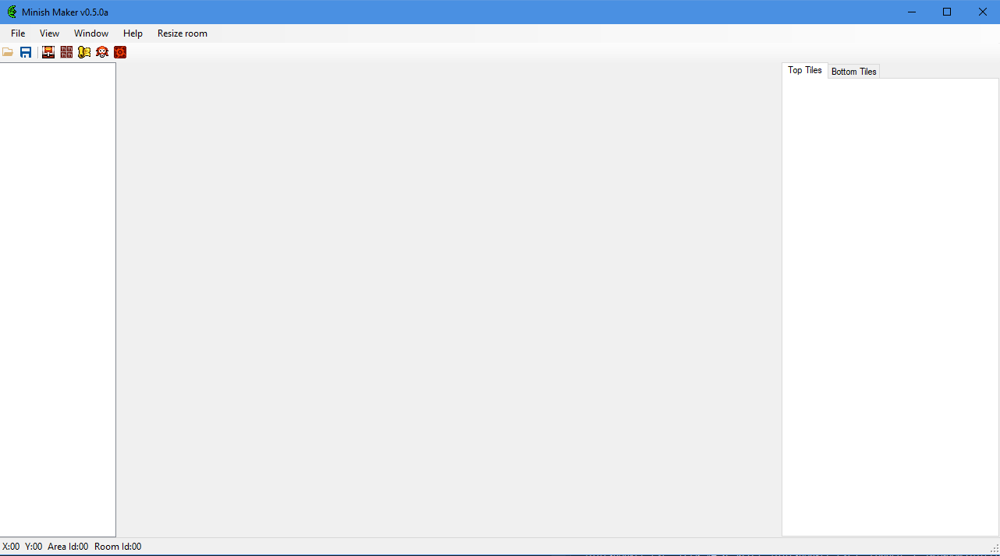

# Getting Started

## First Run

If you followed the steps in the introduction page, you should have downloaded and launched Minish Maker. You'll have been greeted with this window:

This is the central window of the program and ties together all of the sub editors we offer. This window will look very blank to start with as you still need to open a project at this point. How do you open a project?!

## File Menu

The file menu deals with all the project management bits. From the top:

* **New project**. This will open up the project creation window.
* **Open Project**. Open a previously created Minish Maker project.
* **Save Project**. Commit your current changes to the project folder.
* **Build Project**. Saves and generates your romhack from it's source files.
* **Exit**. Hope this doesn't need explained!

### New Project Window

Clicking on **New Project** opens the project creation wizard. From here, you need to enter the following information:

* Project Name. This will appear in the `.mmproj` filename, and the name of the generated ROM. This can be changed later if needed.
* Base ROM. Hit Browse and navigate to an unmodified copy of _The Legend of Zelda: The Minish Cap._ This can be any version of the game \(EU, JP, US\).


Do **not** ask us where to find ROMs of the game, or share them with others who ask for them. Doing so is illegal, so you will have to find your own.


* Project Location: A folder to save all the project files in. This helps keep the project tidy and portable.

Once you've entered the required information, hit **Create Project**. This will generate all of the required files, and create a copy of your supplied ROM in the project folder called `baserom.gba`. 

If you're wanting to get stuck in, jump over to the [Map Editor](map-editor.md). To find out more about how our project system works, read on.

### Open Project

Clicking the Open project button will open up the file selection window. Navigate to where you saved your project, and double click on the file with the extension `.mmproj`.

### Save Project

Saves any changes made throughout the various windows, be sure to use this often.

### Build Project

This will apply all the change patches to a copy of the ROM you provided, and save it in the project folder with the name being the project name you supplied earlier. When building, Minish Maker will also save to make sure all your changes are taken into the new ROM.


Minish Maker uses a build system that is designed around the wonderful [ColorzCore](https://github.com/FireEmblemUniverse/ColorzCore) system built by the Fire Emblem romhacking community. This system allows us to add changes to the ROM in a modular fashion, breaking each component \(map, chest data, enemy data\) into it's own set of instructions that are combined together at build time to create the finished ROM. 

We decided on this method as we noticed a lot of level editors for different games just immediately generated the ROM directly from the input, which can lead to messy versioning and allows the hack to enter an irreversible state if saved incorrectly.

By saving each change as it's own set of files, it allows projects to be managed through version control software \(don't upload the ROM!\) and promotes collaboration on larger hacks. the ColorzCore build language also allows users to directly inject custom patches into the ROM, either generated from other programs or custom assembly files and plugins for features we haven't written yet. We plan to add a visual plugin manager to Minish Maker later for easier management of these files.


### Exit

Exits out of the application, pressing the X button in the top right has the same effect. Be sure to save your changes before doing this.

