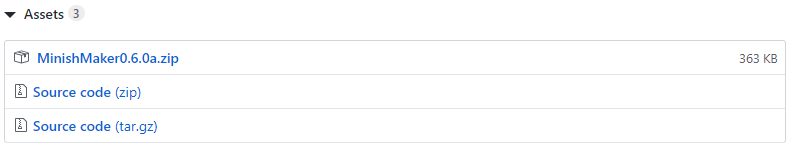

# Minish Maker

## Introduction

Minish Maker is a level editing suite for _The Legend of Zelda: The Minish Cap._ It currently only runs on Windows platforms, but once the main feature set has been completed we plan to make a cross platform version. We support all regional variations of the game \(EU, JP, US\) but development has been focused on the EU version.

## Features

* Map editing \(background 1 and background 2\)
* Chest editing
* Metatile editing
* Area editing
* Object placement editing
* Warp editing

## Download and Installation

You can download Minish Maker from our [GitHub page](https://github.com/minishmaker/minishmaker/releases/latest). The latest release will be at the top of the page, and after the release notes you will see this panel below:

Make sure you download the zip file named **MinishMaker x.x.x.zip**, and not the zip files labelled 'Source code' \(Unless you're interested in helping to develop Minish Maker, in which case look [here](https://github.com/minishmaker/minishmaker/blob/master/CONTRIBUTING.md)!\).

### Installation\(ish\)

Once you've downloaded the zip, unzip it in whatever folder you want. Minish Maker currently functions as a portable app and can be run from most folders.

Note: On Windows 10, you may see this popup when attempting to run the program:

This is normal, and appears because we can't afford to pay for a signing certificate. To run the program, click 'More info' which will reveal the 'Run anyway' button.

